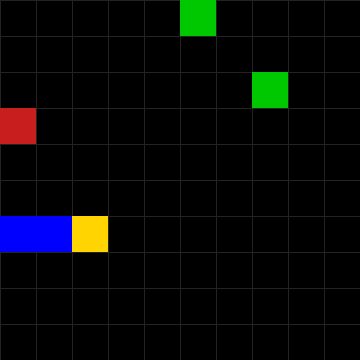

# Learn2Slither

> DQN reinforcement learning agent that learns to play Snake from scratch.

## Overview

A deep Q-learning agent trained to play Snake on a 10x10 grid. The agent learns to navigate, collect green apples, avoid red apples and walls, and manage its growing body using a neural network that maps state observations to actions.

This project was built as part of the 42 school AI curriculum (Reinforcement Learning branch).

## Tech Stack

| Layer     | Technologies                                      |
| --------- | ------------------------------------------------- |
| Language  | Python 3.12                                       |
| Framework | PyTorch (DQN), Pygame (visualization)             |
| Tools     | Matplotlib (training plots), YAML (configuration) |

## Key Features

- DQN agent with experience replay and epsilon-greedy exploration
- 24-dimensional relative state representation encoding wall, food, and body distances in four directional axes from the snake's heading
- Multi-signal reward shaping with proximity incentives, BFS-based trap detection, and starvation penalties
- Fully YAML-configurable hyperparameters, reward values, and network architecture
- Model checkpoint save/load with non-learning evaluation mode
- Real-time Pygame visualization with optional headless training

## Results

| Metric               | Value                                           |
| -------------------- | ----------------------------------------------- |
| State Dimensions     | 24                                              |
| Network Architecture | 24 &rarr; 256 &rarr; 128 &rarr; 3               |
| Actions              | 3 (straight, left, right — relative to heading) |
| Replay Buffer        | 100,000 transitions                             |

## Gameplay Demo

Trained for 1000 headless episodes and recorded a 5-second evaluation clip with exploration disabled.



## Architecture

```
Learn2Slither/
├── snake.py             # Entry point, CLI argument parsing
├── agent.py             # DQN agent (training loop, epsilon decay, replay)
├── model.py             # LinearQNet (PyTorch neural network)
├── environment.py       # Snake game environment (state, rewards, BFS)
├── game_interface.py    # Pygame visualization
├── checkpoint.py        # Model save/load utilities
├── config_loader.py     # YAML configuration loader
├── constants.py         # Colors, block size constants
├── plot_graph.py        # Training curve visualization
├── configs/default.yaml # Default hyperparameters
└── requirements.3.12.txt # Python dependencies
```

## Getting Started

### Prerequisites

```bash
Python 3.11+ (tested on 3.12)
```

### Installation

```bash
git clone https://github.com/sungyongcho/Learn2Slither.git
cd Learn2Slither
pip install -r requirements.3.12.txt
```

### Usage

```bash
# Train a new agent (100 sessions, no visual)
python snake.py --session 100 --visualize false

# Train with visualization
python snake.py --session 100 --visualize true

# Load and evaluate a trained model (no learning)
python snake.py --session 10 --visualize true --load model/1000.pth --dontlearn

# Step-by-step mode
python snake.py --session 10 --visualize true --load model/1000.pth --dontlearn --step-by-step
```

### Training

```bash
# Quick training run
python snake.py --session 1000 --visualize false --save model/portfolio_1000.pth

# Adjust hyperparameters via configs/default.yaml
# Edit configs/default.yaml to change reward values, network size, learning rate, etc.
```

## What This Demonstrates

- **Reinforcement Learning**: Implemented DQN with experience replay, epsilon-greedy exploration, and target network updates for stable Q-value estimation.
- **State Design**: Engineered a 24-dimensional relative observation encoding distances to walls, food, and body segments along four directional axes from the snake's perspective.
- **Reward Engineering**: Designed multi-signal reward shaping combining proximity incentives, BFS-based trap avoidance, and starvation penalties to guide learning beyond sparse terminal rewards.

## License

This project was built as part of the 42 school curriculum.

---

_Part of [sungyongcho](https://github.com/sungyongcho)'s project portfolio._
